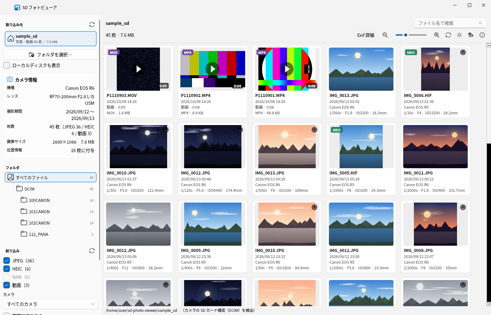
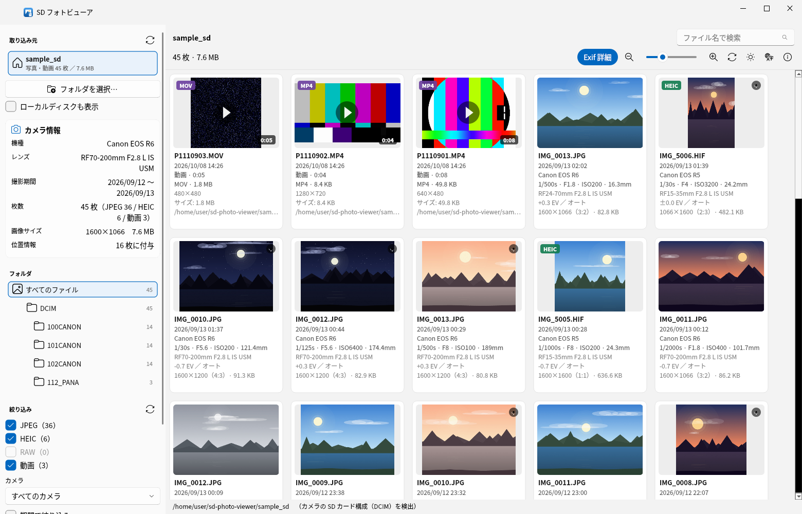
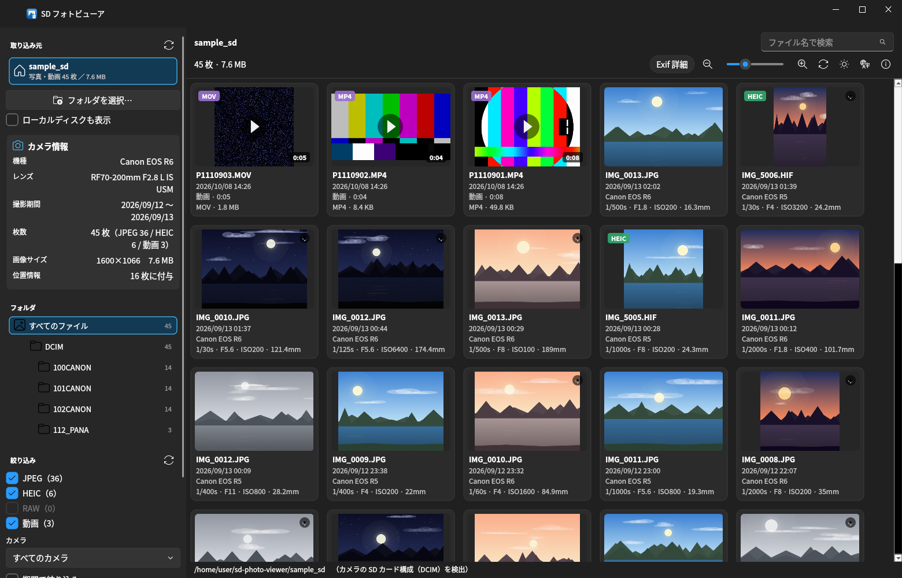
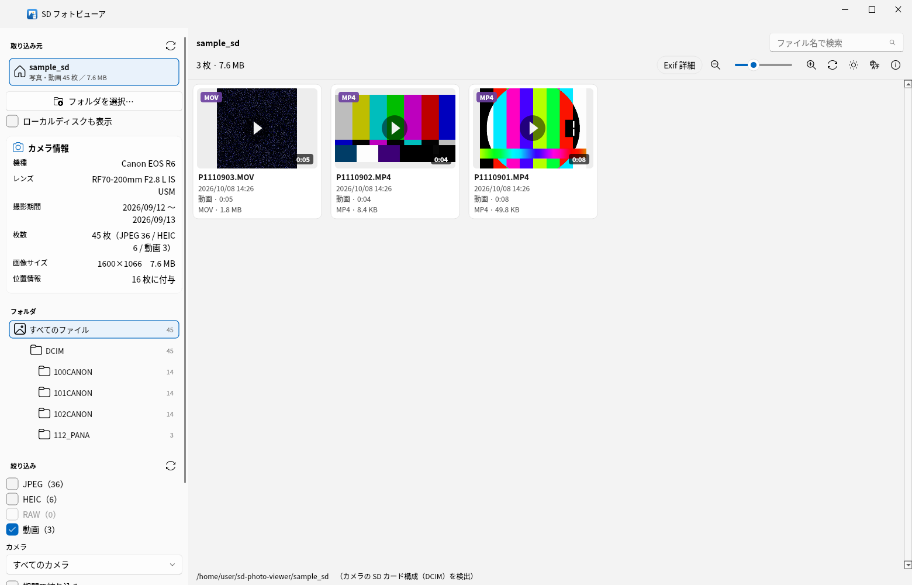
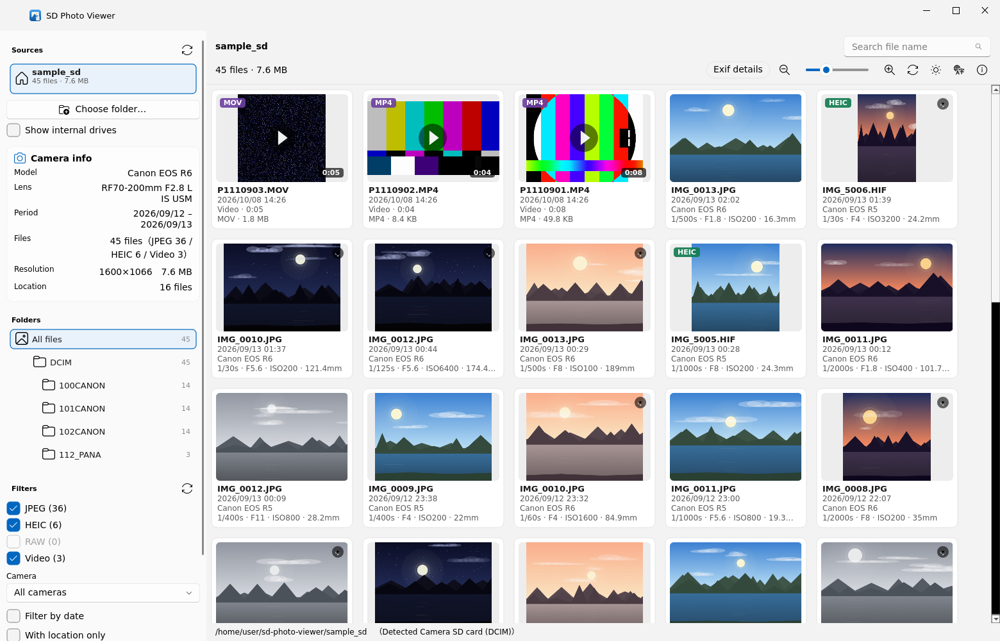
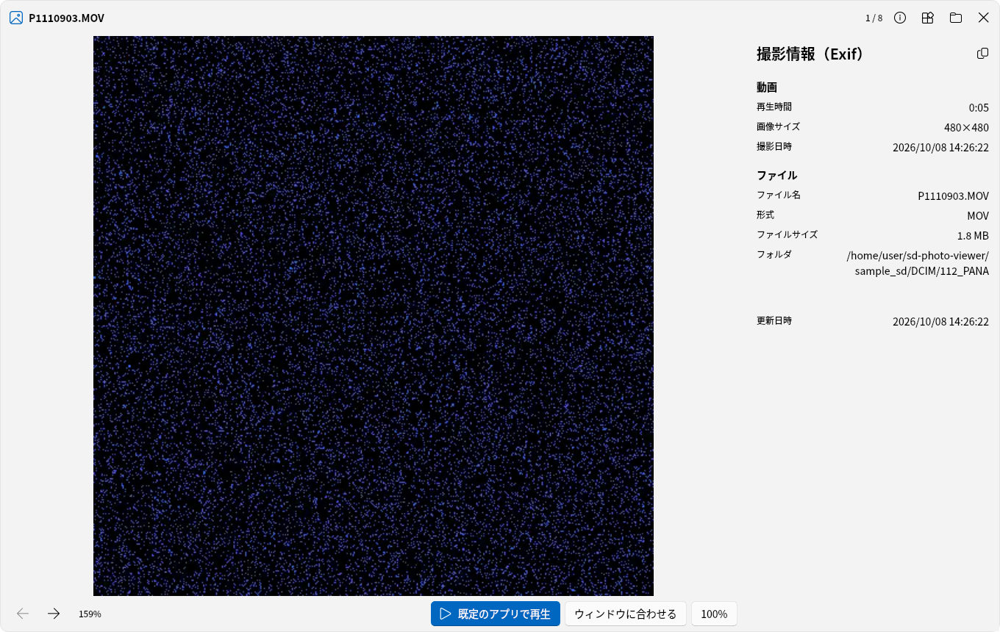
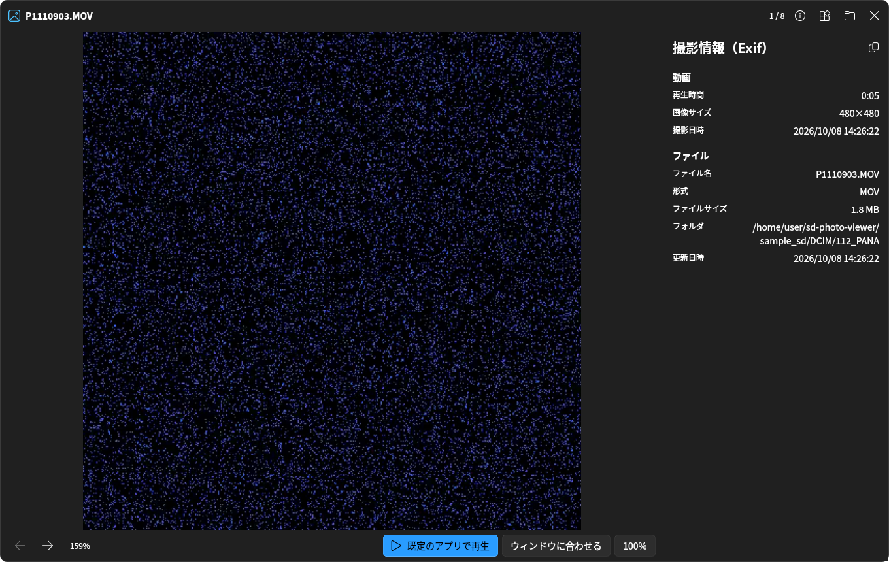

# SDPhotoViewer-apps-WIndows
# SD フォトビューア / SD Photo Viewer
**English (short):** SD Photo Viewer is a Windows 11–style desktop app that shows the photos on
your camera's SD card as easy-to-browse tiles, with Exif data (date, camera, lens, exposure, GPS)
listed under each photo. No installation needed for the built app — just unzip and run the .exe.
HEIC, RAW and video thumbnails are supported. Released under GPLv3.
Source: <https://github.com/Kirin650Townace/SDPhotoViewer-apps-WIndows>

---

カメラの **SD カードの中の写真をタイル状に表示** する Windows 11 風のデスクトップアプリです。
エクスプローラーと同じ感覚で SD カード・フォルダを選び、写真の下に Exif（撮影情報）を並べて表示します。



| Exif 詳細モード | ダークテーマ |
| --- | --- |
|  |  |

| 動画もタイル表示（形式チップ・再生時間つき） | 英語表示（Language ボタンで切り替え） |
| --- | --- |
|  |  |

| 大表示ビューア（Exif パネル付き） | ビューア（ダークテーマ） |
| --- | --- |
|  |  |

---

## 主な機能

### 左パネル（エクスプローラー風）
- **取り込み元**: **リムーバブルディスク（SD カード・USB メモリ・カードリーダー）だけを自動検出**（`更新`ボタンで再検出）
  - 内蔵のローカルディスク（`C:` など）は写真が膨大で読み込みが重くなるため、**既定では検出しません**
  - 見たい場合は左パネルの **「ローカルディスクも表示」** をオンにすると一覧に出ます（オンにした状態は次回も保持）
  - カードリーダーが固定ディスクとして認識される場合に備えて、ドライブ直下に `DCIM` / `PRIVATE` があるものは自動で検出対象にします
  - 特定のフォルダだけ見たいときは **「フォルダを選択…」**（こちらは明示的な指定なので、ローカルディスク内でもそのフォルダだけを読み込みます）
- **カメラ情報**: 読み込んだ写真の Exif から **機種・レンズ・撮影期間・枚数・画像サイズ・位置情報の有無**、カード残容量を自動判定して表示
- **フォルダ**: `DCIM > 100CANON` のような SD カード構成をツリー表示（枚数付き）。クリックでそのフォルダだけ表示
- **絞り込み**: ファイル形式（**JPEG / HEIC / RAW / 動画**）・カメラ機種・撮影期間・位置情報付きのみ
- **並べ替え**: 撮影日時 / ファイル名 / サイズ / 更新日時 / 形式（昇順・降順）

### 写真のタイル表示（右側）
- 角丸カード + サムネイル + **写真の下に Exif 情報**（撮影日時・カメラ・シャッタースピード・F値・ISO・焦点距離など）
- タイルサイズをスライダー / マウスホイール（Ctrl 併用）/ ズームボタンで変更（160〜400px）
- **「Exif 詳細」ボタン**でレンズ・露出補正・ホワイトバランス・画像サイズ・形式・ファイルサイズまで表示
- サムネイル左上に **HEIC / RAW / 動画（MP4・MOV など）チップ**、右上に **位置情報のピン**
- **動画もタイル表示**: 先頭フレームのサムネイル + 再生マーク + 再生時間（`動画 · 0:05`）と形式・ファイルサイズを表示
  - ダブルクリック／右クリックから **既定のアプリ（再生ソフト）で再生** します（アプリ内での再生は行いません）
- 複数選択（Ctrl / Shift）、ダブルクリックで拡大表示
- バックグラウンドで並列サムネイル生成（スクロールしても固まりません）

### 大表示ビューア
- ホイールでズーム、ドラッグで移動、ダブルクリックで等倍／フィット切り替え
- 右側に **Exif 詳細パネル**（撮影情報 / カメラ・レンズ / 画像 / 位置情報 / ファイル）
- ← → キーで前後の写真へ、位置情報があれば「地図で開く」
- Exif 情報をクリップボードへコピー

### そのほか
- **日本語 / 英語の切り替え**（右端の Language ボタン）。切り替えると表示が作り直され、
  **開いていたフォルダはそのまま** 英語（日本語）表示で再開します。設定は次回起動時にも引き継がれます
  （初回は OS の言語で自動判定、`python app.py --lang en` でも起動できます）
- **Windows 標準のフォント**（日本語: Yu Gothic UI → Meiryo UI、英語: Segoe UI 系）をサイズも pt 指定で使用。
  ライブラリ既定の中国語フォント（Microsoft YaHei）は日本語表示時に自動で置き換えます
- Windows 11 の Mica 効果（Windows で起動時に自動適用）
- **ライト / ダークテーマ切り替え**（右上の明るさボタン）。テーマを切り替えると、
  ウィンドウ背景・左パネル・タイル・カードの色がすべて **即座に** 切り替わります
  （切り替え直後に一部が明るいまま残る、ということが起きないようにしています）
- **前回の状態を記憶**（次回起動時にそのまま復元）
  - ライト / ダークテーマ（設定が無い初回は OS の設定に従います）
  - 絞り込み: ファイル形式・カメラ機種・撮影期間・位置情報付きのみ
  - 選んでいたフォルダ（`DCIM/100CANON` など）
  - 最後に開いた SD カード / フォルダ、タイルサイズ、Exif 詳細モード、並び順、表示言語、ウィンドウ位置
  - 絞り込みは変更した時点で保存されるので、強制終了しても残ります
- 右クリックメニュー: 既定のアプリで開く / エクスプローラーで表示 / パスをコピー / Exif をコピー / 画像をコピー
- フォルダをウィンドウへドラッグ＆ドロップして開く
- **SD カードは読み取り専用**（写真の変更・削除・移動は一切行いません）

### ショートカットキー

| キー | 動作 |
| --- | --- |
| `Ctrl` + `O` | フォルダを選択 |
| `F5` | 再読み込み（カードを挿し直した場合など） |
| `Ctrl` + `F` | ファイル名で検索 |
| `Ctrl` + ホイール | タイルサイズの拡大・縮小 |
| `Enter` / ダブルクリック | 大表示で開く |
| `←` / `→`（ビューア） | 前後の写真 |
| `Esc`（ビューア） | 閉じる |
| `0` / `1`（ビューア） | ウィンドウに合わせる / 100% |

---

## 動作環境

| 項目 | 内容 |
| --- | --- |
| OS | Windows 10 / 11（ほか macOS・Linux でも動作します） |
| Python | 3.10 以降（3.13 で動作確認）。**exe 化は 3.10.1 以降を推奨**（3.10.0 は下記の不具合を自動回避） |
| 必須ライブラリ | PySide6、PySide6-Fluent-Widgets、Pillow |

---

## インストールと起動

Releaseから最新バージョンのZipフォルダをダウンロード・解凍し、「SDPhotoViewer.exe」を実行してください。
解凍したフォルダを任意の場所に移動させることもできます。

| 場所 | 何か | 使う？ |
| --- | --- | --- |
| `dist\SDフォトビューア\SDフォトビューア.exe` | **アプリ本体（黒い画面なし）** | **これを使います** |
| `dist\SDフォトビューア\_internal` | 必要なライブラリ | 消さないでください |
| `build\…` | ビルドの作業ファイル | 使いません（開く必要もありません） |
| `dist\SDフォトビューア（デバッグ）` | `--console` を付けた調査用 | 通常版を作ると自動で削除されます |

> ビルドがうまくいかないときだけ、調査用の `python tools\build_exe.py --console` を使ってください。
> このときは `dist\SDフォトビューア（デバッグ）\` に出力され、通常版は上書きされません。

`dist\SDフォトビューア` フォルダには次のものが入ります。フォルダごと渡してください。

| ファイル | 内容 |
| --- | --- |
| `SDフォトビューア.exe` | 実行するファイル（アイコン付き・黒い画面なし） |
| `_internal` | 必要なライブラリ（消さないでください） |
| `ログを保存.txt` | 起動しないときの調べ方 |
| `README.md` / `使い方.md` | 説明書 |

起動しないときは `ログを保存.txt` の手順に従ってください。exe と同じフォルダに
`SDPhotoViewer.log` ができていれば原因が書かれています。

デスクトップから起動したいときは **`ショートカットを作る.bat`** をダブルクリックすると、
アイコン付きのショートカットが作られます（`dist` フォルダは移動・削除しないでください）。

> **黒い画面（コンソール）について**
> 普段使い・配布用は `build_windows.bat`（`--console` なし）でビルドしてください。黒い画面は出ません。
> `--console` を付けて作った調査用の exe は、**ダブルクリックで起動したときは黒い画面を自動で隠します**
> （ターミナルから実行したときだけ、エラーが見えるようにその画面を残します）。
> 調査用の出力名は、通常の exe を上書きしないよう `SDフォトビューア（デバッグ）.exe` になります。
>
> 起動すると、exe と同じフォルダの `SDPhotoViewer.log` に
> 「どのファイルから起動したか」（`起動: C:\...\SDフォトビューア.exe / 実行形式=exe`）が記録されます。
> 黒い画面が出る／起動しないときは、この 1 行を見てもらえれば原因の切り分けができます。

アイコンを変えたい場合は `assets/app.ico` を差し替えてからビルドし直してください
（`assets/` が無い場合は `python tools/make_icon.py` で生成できます）。

> ビルドし直してもエクスプローラーのアイコンが古いままのときは、
> Windows がアイコンをキャッシュしているためです。フォルダごと別の場所へ移動する、
> 名前を変える、または再起動すると新しいアイコンに更新されます。

---

## 使い方（基本の流れ）

1. **SD カードを PC に挿す**（またはカードリーダー経由で接続）
2. 左の「取り込み元」に `EOS_DIGITAL (E:)` のような名前で表示されます → クリック
   - 表示されない場合は **更新ボタン** を押してください
   - 内蔵ディスク（`C:` など）の写真を見たいときは **「ローカルディスクも表示」** をオン
   - 特定のフォルダだけ見たいときは **「フォルダを選択…」**
3. 写真がタイル状に並びます。サムネイルと Exif はバックグラウンドで順次読み込まれます
4. 絞り込み・並べ替え・検索で目的の写真を探す
5. 写真をダブルクリックすると **大表示ビューア** が開きます（← → で送り）

### 対応している写真形式

| 形式 | 拡張子 | 必要なもの |
| --- | --- | --- |
| JPEG / PNG / WebP / BMP / TIFF / GIF | `.jpg` `.jpeg` `.png` `.webp` `.bmp` `.tif` `.gif` など | 標準で対応 |
| HEIC / HEIF（キヤノンの `.HIF`、iPhone など） | `.heic` `.heif` `.hif` `.avif` | `pip install pillow-heif` |
| RAW（CR3 / CR2 / NEF / ARW / DNG / RAF など） | `.cr3` `.cr2` `.nef` `.arw` `.dng` など | `pip install rawpy` |
| 動画（サムネイル表示・再生は既定アプリ） | `.mp4` `.mov` `.m4v` `.mts` `.m2ts` `.avi` `.mkv` `.wmv` `.3gp` など | `pip install imageio-ffmpeg`（ffmpeg 本体を同梱） |

未導入の形式があると、該当する写真が見つかったときに画面右下に案内が出ます。
動画のサムネイルは **ffmpeg** で生成します。`pip install imageio-ffmpeg` で同梱の ffmpeg が入るため、
別途 ffmpeg をインストールする必要はありません（PATH 上に ffmpeg がある場合はそちらを優先します）。
RAW は埋め込みプレビューを優先して高速に表示します（現像処理を行うため、RAW が多い場合は表示に少し時間がかかります）。

---

## タイルに表示される Exif 情報

**標準モード**（写真の下 4 行）

- ファイル名（`IMG_0013.JPG`）
- 撮影日時（`2026/09/13 02:02`）
- カメラ（`Canon EOS R6`）
- 露出（`1/500s · F1.8 · ISO200 · 16.3mm`）

**「Exif 詳細」モード**（+3 行）

- レンズ（`RF24-70mm F2.8 L IS USM`）
- 露出補正・ホワイトバランス（`+0.3 EV ／ オート`）
- 画像サイズ・アスペクト比・ファイルサイズ（`1600×1066（3:2）· 82.8 KB`）

**動画のタイル**（標準モード）

- ファイル名（`P1110901.MP4`）
- 記録日時（ファイルの日時）
- `動画 · 0:08`
- 形式とファイルサイズ（`MP4 · 49.8 KB`）

大表示ビューアでは、動画は **先頭フレームのプレビュー + 再生時間・解像度・ファイル情報** を表示し、
下部の「既定のアプリで再生」ボタンから再生ソフトを起動できます。

**大表示ビューアの右パネル**では、さらに測光モード・露出プログラム・露出モード・フラッシュ・メーカー・ボディシリアル・ソフトウェア・撮影者・著作権・色空間・画素数・緯度経度・高度まで確認できます。

---

## ファイル構成

```
sd-photo-viewer/
├── app.py                    起動スクリプト（引数の処理、テーマの初期化）
├── はじめにお読みください.md   配布物に入る、使う人向けの README（ビルド時に dist へ）
├── LICENSE                   このアプリのライセンス（GPLv3 の正文）
├── THIRD_PARTY_LICENSES.md   同梱ライブラリのライセンス一覧と配布時の注意
├── licenses/                 GPLv3 / LGPLv3 の正文（ビルド時に配布物へ入ります）
├── requirements.txt
├── run_windows.bat           Python で起動（黒い画面なし）
├── build_windows.bat         exe をビルド
├── 配布用ZIPを作る.bat        配布用の ZIP（Releases に添付するもの）を作成
├── ショートカットを作る.bat     デスクトップに起動用ショートカットを作成
├── sdphotoviewer/            本体
│   ├── mainwindow.py         画面全体の組み立てと制御
│   ├── sidebar.py            左パネル（取り込み元 / カメラ情報 / フォルダ / 絞り込み）
│   ├── gallery.py            右側の一覧（ツールバー・空状態・進捗・右クリックメニュー）
│   ├── delegate.py           タイル1枚の描画（写真 + Exif）
│   ├── viewer.py             大表示ビューア（ズーム・Exif パネル）
│   ├── model.py              一覧データ・絞り込み・並べ替え・集計
│   ├── exifdata.py           Exif の読み取りと日本語表示の整形
│   ├── imaging.py            画像の読み込み（Qt / Pillow / pillow-heif / rawpy）
│   ├── sources.py            SD カード・ドライブの検出、フォルダ走査
│   ├── workers.py            スキャン / Exif 解析 / サムネイル生成（別スレッド）
│   ├── theme.py              Windows 11 風の配色・フォント
│   ├── i18n.py               日本語 / 英語の文言
│   └── compat.py             任意ライブラリの検出（ffmpeg・pillow-heif・rawpy）
├── tools/
│   ├── make_sample_sd.py     動作確認用のサンプル SD カードを生成
│   ├── selftest.py           機能の自動テスト
│   ├── screenshot.py         スクリーンショット作成
│   ├── dev_setup_linux.sh    開発用の環境準備（Linux / CI）
│   ├── build_exe.py          PyInstaller で exe 化
│   ├── make_release_zip.py   配布用の ZIP を作成
│   ├── make_icon.py          アプリのアイコン（assets/app.ico）を生成
│   └── _pyinstaller_entry.py Python 3.10.0 の dis 不具合を回避してビルド
├── assets/                   アプリのアイコン（app.ico / app.png）
├── sample_sd/                サンプル写真と動画（DCIM/100CANON …、45 件）
└── docs/                     スクリーンショット
```

---

## 開発者向け

```bash
# 動作確認用のサンプル SD カードを作る（Exif・位置情報付きのダミー写真）
python tools/make_sample_sd.py --count 42

# 機能の自動テスト（112 項目: スキャン / Exif / 絞り込み / 並べ替え / サムネイル / ビューア /
#                               動画 / 日英の文言 / フォント / 設定の保存と復元 / レイアウト / テーマ）
python tools/selftest.py

# スクリーンショットを作る
python tools/screenshot.py
```

設定は `QSettings` に保存されます（Windows: レジストリ `HKCU\Software\SDPhotoViewer\SDPhotoViewer`）。

### ダークテーマの作り込み

- タイルの文字色・枠線・ホバー色はテーマに応じて描画時に切り替えます（`theme.py` に配色を集約）
- 縦長写真の左右に出る余白は、ダークではカード背景よりわずかに沈んだ色にして「穴」に見えないようにしています
- SD カードのアイコン・プレースホルダのアイコンは色を持っているため、テーマ切り替え時に作り直します
- 自作部分は即時に切り替わるため、ライブラリ側の背景色アニメーション（120ms）は止めて即時反映に合わせています

### 実装のポイント

- **重い処理はすべて別スレッド**: フォルダ走査・Exif 解析・サムネイル生成をワーカーに分離し、`epoch`（世代番号）で古い結果を破棄します
- **サムネイルは優先度付きキュー**: 画面に見えている写真を最優先、スクロール後に残りを先読みします
- **タイルは自前描画**: `QStyledItemDelegate` で Windows 11 風のカードを描画（ヘッダーカードの「Exif 詳細」で行数が増えてもレイアウトが崩れません）
- **ファイル形式チップ・位置情報ピン・SD カードアイコンはベクター描画**（画像ファイル不要）

### 変更履歴

**公開版**

- **v1.0**（初回公開）
  - 開発中の内部バージョン 1.0.0〜1.3.0 の内容をまとめた最初の公開版
  - 配布物には「はじめにお読みください」（v1.0 の利用者向け README）を同梱
  - 「アプリについて」（右上の ⓘ）にバージョン・著作権・GPLv3・無保証の告知を表示

**開発中の履歴（内部バージョン）**

- **1.3.0**
  - 「アプリについて」ボタン（右上の ⓘ）を追加。バージョン・著作権・ライセンス（GPLv3）・
    ソースコードの場所・無保証の告知をアプリ内で確認できるようにしました（GPLv3 の条件）
  - 公開（配布）用に `LICENSE`（GPLv3 正文）と `THIRD_PARTY_LICENSES.md` を用意
  - ビルドすると `dist/` に `LICENSE` と `licenses/`（ライセンス文一式・9 ファイル）が自動で入ります

- **1.2.2**
  - **ビルド後の案内を分かりやすくしました**。ビルドが終わると `dist` フォルダが自動で開き、
    「使うファイル」の絶対パスを枠で囲んで表示します
  - 通常版をビルドしたときは、調査用の `SDフォトビューア（デバッグ）` フォルダを自動で片付けます
    （どちらを使えばよいか迷わないように）
  - 「どのフォルダを使うのか」の表を README に追加
- **1.2.1**
  - **黒い画面が残らないようにしました**。調査用（`--console`）の exe をダブルクリックで起動した場合は、
    自分専用のコンソールと判断して自動的に隠します（ターミナルから実行したときは、
    エラーが見えるようその画面を残します）
  - 起動のたびに `SDPhotoViewer.log` へ「起動したファイル・実行形式・引数」を記録するようにしました
    （どの exe を動かしているかの確認に使えます）
- **1.2.0**
  - **ダークモードが起動のたびに戻ってしまう問題を修正**。テーマをアプリの設定に保存し、
    次回起動時に復元するようにしました（保存が無いときは OS のライト / ダーク設定に従います）
    - あわせて、ライブラリ（qfluentwidgets）の設定ファイルを実行フォルダに作らないようにしました
  - **絞り込み（形式 / カメラ / 期間 / 位置情報）と選択フォルダを記憶**するようにしました。
    変更した時点で保存し、次回起動時にスキャン完了後に自動で復元します
  - 走査中にウィンドウを閉じたときに落ちることがある問題を修正（スレッドの終了を待つように）
  - 自動テストを 100 項目に拡充（設定の保存・復元、テーマの優先順位の検証を追加）
- **1.1.3**
  - **黒い画面（コンソール）が出ないように整備**。調査用の `--console` ビルドは
    出力名が `SDフォトビューア（デバッグ）.exe` になり、通常の exe を上書きしません
  - `run_windows.bat` は `pythonw` で起動して、画面が残らないようにしました
  - **`ショートカットを作る.bat`** を追加（デスクトップにアイコン付きショートカットを作成）
  - 黒い画面の無い exe でエラーが起きたときは、`SDPhotoViewer.log` への記録に加えて
    画面にもメッセージを出すようにしました
- **1.1.2**
  - **アプリのアイコンを追加**（角丸タイル + 写真 + SD カード）。exe に埋め込まれ、
    タイトルバー・タスクバー・エクスプローラーの表示も同じ絵柄になります
  - **ビルド時に読み込みチェックを実行**し、必須ライブラリが欠けていれば先に知らせるようにしました
  - **起動しないときに原因が分かるように**なりました。落ちた内容を exe と同じフォルダの
    `SDPhotoViewer.log` に記録し、`dist` に `ログを保存.txt`（調べ方の案内）を同梱します
  - `python tools/build_exe.py --debug` で、ビルドせずに読み込み状態だけ確認できます
- **1.1.1**
  - **Python 3.10.0 の環境で exe ビルドが失敗する問題に対応**。
    Python 3.10.0 の `dis` モジュール側の不具合（bpo-45757）で PyInstaller の解析が
    `IndexError: tuple index out of range` で落ちるため、Python 本体を書き換えずに
    実行時だけ回避するヘルパー（`tools/_pyinstaller_entry.py`）を追加しました
    （3.10.1 以降や 3.11 以降では今までどおりの経路でビルドします）
- **1.1.0**
  - **動画（MP4 / MOV など）をタイル表示に対応**。先頭フレームのサムネイル・再生マーク・
    再生時間・形式を表示し、ダブルクリックや右クリックから既定のアプリで再生できます
    （ffmpeg は `imageio-ffmpeg` の同梱バイナリを使用）
  - **日本語 / 英語の切り替えに対応**（ギャラリーツールバー右端の Language ボタン、`--lang` オプション）。
    初回は OS の言語で自動判定し、設定に保存します
  - **フォントを Windows 標準に変更**（日本語: Yu Gothic UI → Meiryo UI、英語: Segoe UI 系）。
    サイズ指定をピクセルから pt に変更し、日本語表示時に中国語フォント（Microsoft YaHei）が
    使われないようにしました
  - 絞り込みに「動画」を追加（カメラ情報の内訳・フォルダごとの件数にも動画を含む）
  - 自動テストを 88 項目に拡充（動画・言語・フォント・レイアウトの検証を追加）
- **1.0.1**
  - 左パネルの「絞り込み」見出しがレイアウトに組み込まれず、左上で
    「取り込み元」と重なって表示される不具合を修正
  - レイアウトへの入れ忘れを検出する自動テストを追加（再発防止）
- **1.0.0** 初版

### 既知の制限

- 動画はサムネイル（先頭フレーム）表示のみで、アプリ内での再生は行いません（「既定のアプリで再生」から再生します）
- RAW のサムネイルは埋め込みプレビューを使用します（無い場合は現像処理のため時間がかかります）
- サムネイルは最大 400 枚分をメモリに保持し、古いものから解放します

---

## 公開（配布）について

このアプリは **GPLv3 で公開する前提** で作っています（同梱ライブラリに GPL のものが含まれるため）。
作者情報（名前・連絡先）とソースコードの公開先は記入済みです。
ソースを置く場所を変えたときは、`sdphotoviewer/__init__.py` の `SOURCE_URL` を書き換えてください。

### 作者情報（記入済み）

| 項目 | 値 | 入っている場所 |
| --- | --- | --- |
| 名前 | よづき | `sdphotoviewer/__init__.py`（`COPYRIGHT_HOLDER`）／`app.py`／`はじめにお読みください.md` |
| 連絡先 | X (Twitter) [@YoZKi_VRC](https://www.twitter.com/YoZKi_VRC) | `sdphotoviewer/__init__.py`（`CONTACT` / `CONTACT_URL`）／`はじめにお読みください.md` |
| ソースコード | <https://github.com/Kirin650Townace/SDPhotoViewer-apps-WIndows> | `sdphotoviewer/__init__.py` の `SOURCE_URL`（アプリの「アプリについて」と `はじめにお読みください.md` に反映） |

> アプリの「アプリについて」に公開先が表示され、「ソースコードを開く」ボタンからブラウザで開けます。

### 配布するときの名前

- 配布物（ZIP）の名前は `SDフォトビューア_v1.0_windows.zip` のように、バージョンを入れると分かりやすいです
- アプリ内のバージョン表示は `sdphotoviewer/__init__.py` の `__version__` です（今は `1.0`）
  - 次に更新するときは、`__version__` と配布物の名前を一緒に上げてください（例: `1.0.1`）
- フォルダの中に入る利用者向けの説明は **`はじめにお読みください.md`** です。
  文面を直したいときはこのファイルを編集してください（ビルド時に `dist` へ自動で入ります。
  `.txt` 版も一緒に入ります）

### リポジトリに上げるファイル（46 個）

ブラウザで GitHub のリポジトリを開き、**「Add file」→「Upload files」** に
下の表の「上げる」を**フォルダごとドラッグ＆ドロップ**すればOKです（git コマンドは不要）。

| 上げる | 中身 |
| --- | --- |
| `app.py` | 起動スクリプト |
| `sdphotoviewer/`（14 ファイル） | アプリ本体 |
| `tools/`（9 ファイル） | ビルド・テスト・サンプル作成・配布 ZIP 作成の道具 |
| `assets/`（2 ファイル） | アプリアイコン |
| `docs/`（7 ファイル） | スクリーンショット（README に表示されます） |
| `licenses/`（2 ファイル） | GPLv3 / LGPLv3 の正文 |
| `README.md` / `使い方.md` / `はじめにお読みください.md` | 説明書 |
| `LICENSE` / `THIRD_PARTY_LICENSES.md` | このアプリと同梱ライブラリのライセンス |
| `requirements.txt` / `build_windows.bat` / `run_windows.bat` / `ショートカットを作る.bat` / `配布用ZIPを作る.bat` / `.gitignore` | セットアップ・ビルド・配布用（直下の 6 ファイル） |

| 上げない | 理由 |
| --- | --- |
| `dist/` `build/` `*.spec` | ビルドの成果物・作業用（各 PC で作れる。配布は Releases へ） |
| `__pycache__/` `SDPhotoViewer.log` | 実行時にできるもの |
| `sample_sd/`（45 ファイル） | `python tools/make_sample_sd.py` で作り直せるダミー写真（リポジトリを軽く保つため） |

> 一度に 100 ファイルまでアップロードできます。上記は 46 ファイルなので 1 回で入ります。
> `docs/` を忘れると README の画像が表示されません。

### GitHub で公開する手順（例）

1. リポジトリを作り、上の「上げる」を置く
2. リポジトリの「About」で License を **GPL-3.0** に設定する（済み）
3. `配布用ZIPを作る.bat` で作った `SDフォトビューア_v1.0_windows.zip` を **Releases** に添付する
4. 受け取った人がソースを入手してビルドできるよう、この README の手順を公開しておく

### 配布物に必ず入るもの（ビルド時に自動で入ります）

`dist/SDフォトビューア/` … `LICENSE`（GPLv3 正文）／`licenses/`（GPLv3・LGPLv3・
Pillow・numpy・imageio-ffmpeg・pillow-heif の各ライセンス文と一覧）／`THIRD_PARTY_LICENSES.md`

### 気をつけること

- 実際の写真（人物・位置情報）が入ったスクリーンショットは公開しないでください
- 「追加の制限」を課さない（GPLv3 で認められている使い方を妨げない）でください
- ソースを公開していること・無保証であることを、README などで伝えてください

---

## ライセンス

このアプリ（SD フォトビューア）は **GNU General Public License v3.0（GPLv3）** で公開しています。
Copyright (C) 2026 よづき（X: [@YoZKi_VRC](https://www.twitter.com/YoZKi_VRC)）
正文は [LICENSE](LICENSE) をご覧ください。無保証です。

同梱ライブラリのライセンスに従います。**配布（インターネット等での公開）を考えている場合は、
先に [THIRD_PARTY_LICENSES.md](THIRD_PARTY_LICENSES.md) をお読みください。**

| ライブラリ | ライセンス |
| --- | --- |
| PySide6（Qt 本体） | LGPL-3.0（同梱可。ライセンス文の同梱が必要） |
| **PySide6-Fluent-Widgets** | **GPLv3**（これを使うとアプリ全体を GPLv3 で公開する必要があります） |
| pillow-heif（HEIC 対応） | 本体は BSD-3 / **配布用ビルドは GPLv2**（x265 のため） |
| 同梱の ffmpeg（動画サムネイル用） | GPLv3 |
| Pillow / numpy / imageio-ffmpeg | MIT-CMU / BSD / BSD-2 |
| PyInstaller（exe 作成の道具） | GPL-2.0+ ブートローダ例外（**作った exe は GPL にならない**） |

ビルドすると `dist/SDフォトビューア/licenses/` にライセンス文一式が自動で入ります。
そのフォルダごと配布してください。GPLv3・LGPLv3・各ライブラリの正文は `licenses/` に置いてあります。
